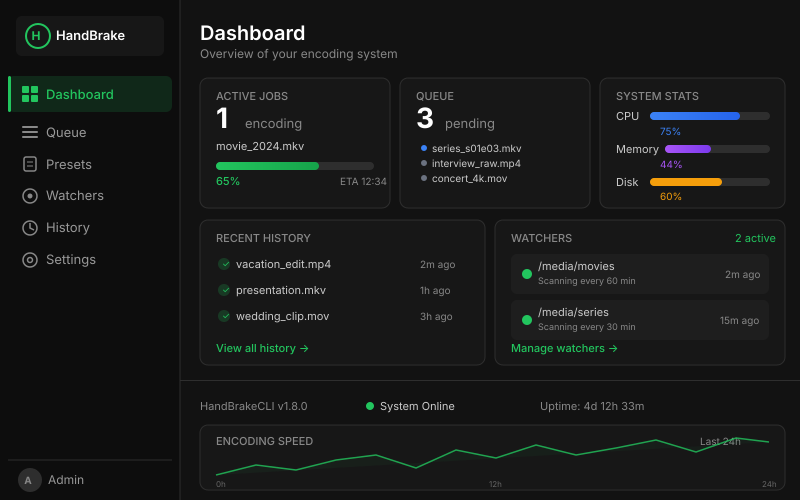
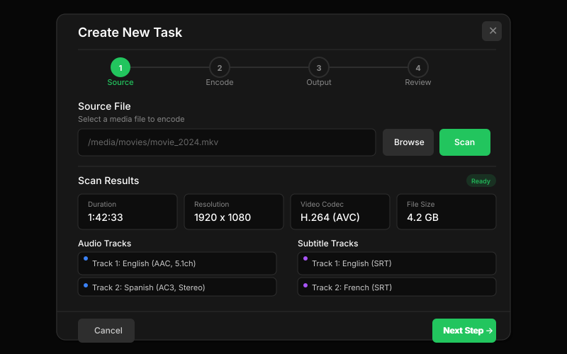
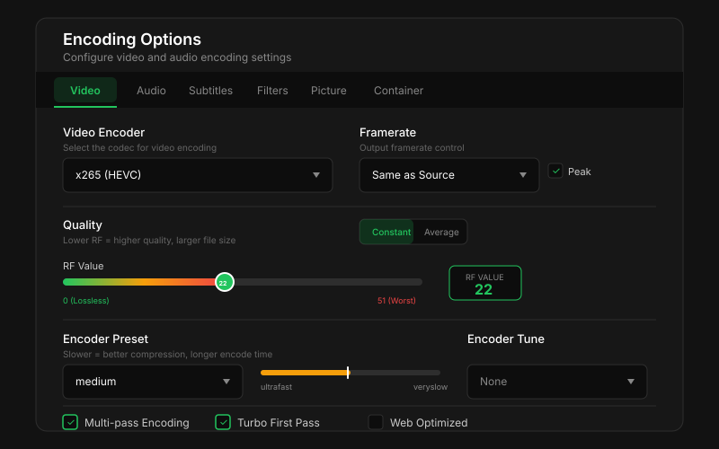
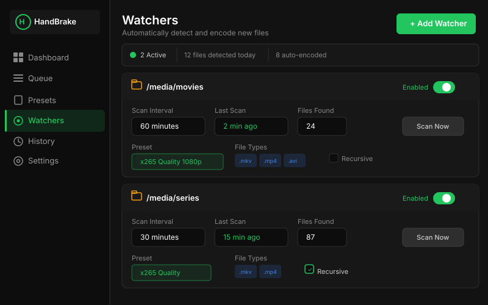
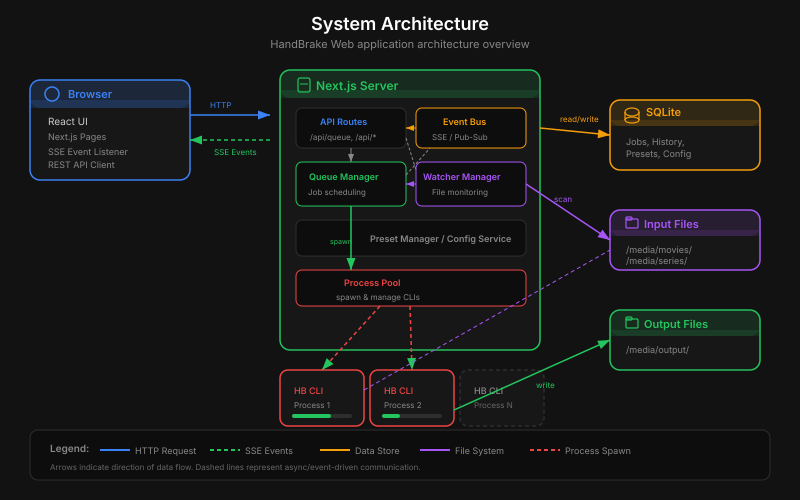
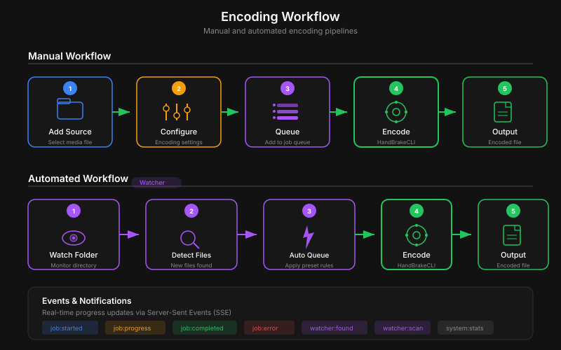

# HandBrake Web



## Descripcion

HandBrake Web es un frontend web moderno para **HandBrakeCLI**, construido con **Next.js 16**, **SQLite** (via better-sqlite3), y **Tailwind CSS 4**. Ofrece una alternativa simple y auto-hospedada a herramientas como Tdarr, permitiendo gestionar la transcodificacion de video desde cualquier navegador.

Con HandBrake Web puedes:

- Crear tareas de encoding de video manualmente, con control total sobre cada parametro.
- Vigilar carpetas automaticamente para transcodificar archivos nuevos sin intervencion.
- Programar horarios de operacion para que el encoding solo se ejecute en determinados momentos.
- Acceder a todas las opciones de HandBrakeCLI (video, audio, subtitulos, filtros, imagen, contenedor) desde una interfaz web limpia y responsiva.
- Monitorizar el progreso en tiempo real gracias a Server-Sent Events (SSE).
- Gestionar presets reutilizables e importar presets nativos de HandBrake en formato JSON.

---

## Capturas de Pantalla

| Vista | Imagen |
|-------|--------|
| Dashboard principal |  |
| Crear tarea |  |
| Opciones de encoding |  |
| Vigilancia de carpetas |  |
| Arquitectura del sistema |  |
| Flujo de trabajo |  |

---

## Caracteristicas

### Gestion de Tareas
- Creacion manual de tareas de encoding con control completo sobre cada parametro.
- Cola de tareas con prioridad y orden personalizable.
- Limite de tareas concurrentes configurable (por defecto 1).
- Acciones sobre tareas en ejecucion: pausar, reanudar, cancelar, reintentar.
- Auto-inicio de la cola: las tareas comienzan automaticamente al ser creadas.
- Progreso en tiempo real con porcentaje, FPS, FPS promedio y tiempo estimado.

### Vigilancia de Carpetas (Watchers)
- Vigilancia automatica de una o mas carpetas en busca de archivos de video nuevos.
- Escaneo recursivo o solo en el nivel superior.
- Intervalo de escaneo configurable (en minutos).
- Filtro por extensiones de archivo (`.mkv`, `.mp4`, `.avi`, `.mov`, `.wmv`, `.flv`, `.ts`, `.m4v`, `.webm`).
- Asignacion de un preset predefinido a cada watcher.
- Dos modos de salida: directorio fijo o junto al archivo fuente.
- Patron de nombres personalizable con tokens dinamicos.
- Tamano minimo de archivo configurable para evitar procesar archivos incompletos.

### Presets
- Crear, editar, eliminar y duplicar presets de encoding.
- Establecer un preset como predeterminado.
- Importar presets desde archivos JSON nativos de HandBrake (formato `PresetList`).
- Exportar presets para compartir entre instancias.
- Soporte para presets con carpetas/categorias anidadas de HandBrake.

### Opciones de Encoding Completas
- **Video**: Todos los encoders soportados por HandBrake (x264, x265, NVENC H.264/H.265, SVT-AV1, VP9, y mas).
- **Audio**: Multiples pistas, passthrough, AAC, AC3, EAC3, TrueHD, Opus, FLAC, ALAC, y mas.
- **Subtitulos**: Seleccion de pistas, burn-in, forzado, pista por defecto, archivos SRT externos.
- **Filtros**: Deinterlace, denoise, deblock, rotacion, espejo, escala de grises.
- **Imagen**: Resolucion, modo anamorfico, recorte automatico/manual, modulo.
- **Contenedor**: MKV, MP4, WebM, marcadores de capitulos, optimizacion web.

### Programacion (Schedule)
- Modo "siempre activo" para encoding continuo.
- Ventana de tiempo: solo permitir encoding entre horas especificas (ej. 22:00 a 06:00).
- Seleccion de dias de la semana.
- Expresiones cron para programacion avanzada.
- El horario solo afecta al inicio de nuevas tareas; no detiene las que estan en ejecucion.

### Dashboard y Monitoreo
- Vista general del sistema: CPU, memoria, disco.
- Tareas activas con progreso en tiempo real.
- Resumen de la cola (pendientes, en ejecucion, completadas).
- Estado de los watchers activos.
- Historial reciente de tareas completadas/fallidas.
- Actualizaciones en tiempo real via Server-Sent Events (SSE).

### Historial
- Registro completo de tareas finalizadas (completadas, fallidas, canceladas).
- Comparacion de tamano de archivo (entrada vs salida).
- Tiempo total de encoding.
- Filtrado por estado.
- Paginacion configurable.

### Navegador de Archivos
- Explorador de directorios integrado para seleccionar archivos fuente y rutas de salida.
- Ordenamiento: carpetas primero, luego archivos, ambos alfabeticamente.
- Muestra tamano y fecha de modificacion de cada archivo.
- Oculta archivos y carpetas que comienzan con punto (`.`).

### Soporte GPU
- Aceleracion por hardware con NVIDIA NVENC (H.264 y H.265).
- Soporte para AMD VCE (H.264, H.265, H.265 10-bit).
- Configuracion de GPU en Docker con `nvidia-container-toolkit`.

---

## Requisitos Previos

| Requisito | Detalles |
|-----------|----------|
| **Node.js** | Version 20 o superior (incluido en la imagen Docker) |
| **HandBrakeCLI** | Instalado automaticamente en Docker. Para instalacion manual, ver [handbrake.fr](https://handbrake.fr) |
| **Docker** (opcional) | Docker Engine 20+ y Docker Compose V2 |
| **NVIDIA GPU** (opcional) | Drivers NVIDIA instalados en el host + `nvidia-container-toolkit` para encoding por GPU |

---

## Instalacion

### Opcion 1: Docker (Recomendado)

Docker es el metodo recomendado porque incluye automaticamente HandBrakeCLI y todas las dependencias necesarias.

#### Paso 1: Clonar el repositorio

```bash
git clone https://github.com/tu-usuario/handbrake-web.git
cd handbrake-web
```

#### Paso 2: Configurar volumenes

Edita el archivo `docker-compose.yml` para mapear tus carpetas de medios:

```yaml
services:
  handbrake-web:
    build: .
    image: alex/handbrake-web:latest
    container_name: handbrake-web
    ports:
      - "3000:3000"
    volumes:
      - handbrake-data:/app/data           # Base de datos SQLite (persistencia)
      - /ruta/a/tus/peliculas:/media/input  # Carpeta de entrada
      - /ruta/a/tu/salida:/media/output     # Carpeta de salida
      # Puedes agregar mas carpetas:
      # - /ruta/a/series:/media/series
      # - /ruta/a/anime:/media/anime
    environment:
      - NODE_ENV=production
    restart: unless-stopped
    healthcheck:
      test: ["CMD", "curl", "-f", "http://localhost:3000/api/system"]
      interval: 30s
      timeout: 10s
      retries: 3
      start_period: 15s

volumes:
  handbrake-data:
    driver: local
```

#### Paso 3: Iniciar el contenedor

```bash
docker compose up -d --build
```

La aplicacion estara disponible en `http://localhost:3000`.

#### Paso 4: Verificar el estado

```bash
docker compose logs -f handbrake-web
```

#### Configuracion de volumenes en Windows

En Windows con Docker Desktop, las rutas se mapean de forma diferente:

```yaml
volumes:
  - handbrake-data:/app/data
  - //c/Users/TuUsuario/Videos:/media/input
  - //c/Users/TuUsuario/Videos/encoded:/media/output
```

O con la sintaxis alternativa:

```yaml
volumes:
  - handbrake-data:/app/data
  - C:\Users\TuUsuario\Videos:/media/input
  - C:\Users\TuUsuario\Videos\encoded:/media/output
```

---

### Opcion 2: Desde codigo fuente

Si prefieres ejecutar la aplicacion directamente en tu sistema, necesitas tener Node.js 20+ y HandBrakeCLI instalados.

#### Paso 1: Instalar dependencias

```bash
npm install
```

> **Nota:** El paquete `better-sqlite3` requiere herramientas de compilacion nativas (Python 3, make, g++ en Linux; Build Tools en Windows). Si tienes problemas, consulta la [documentacion de better-sqlite3](https://github.com/WiseLibs/better-sqlite3/blob/master/docs/troubleshooting.md).

#### Paso 2: Compilar la aplicacion

```bash
npm run build
```

#### Paso 3: Iniciar en modo produccion

```bash
npm start
```

La aplicacion se ejecutara en `http://localhost:3000`.

#### Paso 4: Verificar que HandBrakeCLI es accesible

Asegurate de que `HandBrakeCLI` esta en tu PATH o configura la ruta completa en la seccion de Settings de la aplicacion.

```bash
HandBrakeCLI --version
```

---

### Opcion 3: Desarrollo local

Para desarrollo con recarga automatica (hot reload):

```bash
npm install
npm run dev
```

La aplicacion se iniciara en modo desarrollo en `http://localhost:3000` con recarga automatica al modificar archivos.

Comandos adicionales disponibles:

| Comando | Descripcion |
|---------|-------------|
| `npm run dev` | Servidor de desarrollo con hot reload |
| `npm run build` | Compilar para produccion |
| `npm start` | Iniciar servidor de produccion |
| `npm run lint` | Ejecutar ESLint |

---

## Guia de Uso

### 1. Configuracion Inicial (Settings)

Al iniciar HandBrake Web por primera vez, es recomendable configurar los ajustes globales. Navega a la seccion **Settings** desde la barra lateral.

#### Campos de configuracion

| Campo | Descripcion | Valor por defecto |
|-------|-------------|-------------------|
| **HandBrakeCLI Path** | Ruta completa al ejecutable de HandBrakeCLI. Si esta en el PATH del sistema, basta con `HandBrakeCLI`. En Docker, ya esta configurado automaticamente. | `HandBrakeCLI` |
| **Concurrent Limit** | Numero maximo de tareas de encoding que se ejecutan simultaneamente. Un valor de `1` es recomendado para CPU; con GPU puedes subir a `2` o `3` dependiendo de tu hardware. | `1` |
| **Auto Start Queue** | Si esta activado (`true`), las tareas nuevas comienzan a procesarse automaticamente al ser creadas. Si esta desactivado, debes iniciar la cola manualmente. | `true` |
| **Default Output Dir** | Directorio de salida predeterminado para nuevas tareas y watchers con modo "directorio fijo". | `/output` |
| **Default Output Pattern** | Patron de nombre para los archivos de salida. Usa tokens como `{name}`, `{ext}`, `{date}`, `{encoder}`, `{quality}`. | `{name}_encoded.{ext}` |

#### Programacion (Schedule)

La programacion controla **cuando** se permite iniciar nuevas tareas de encoding:

| Modo | Descripcion |
|------|-------------|
| **Always** | El encoding esta permitido en todo momento. La cola se procesa continuamente. |
| **Time Window** | Solo se inician nuevas tareas dentro de una ventana horaria (ej. de 22:00 a 06:00). |
| **Cron** | Programacion avanzada mediante expresiones cron para escenarios mas complejos. |

Opciones adicionales del schedule:

- **Dias de la semana**: Selecciona en que dias aplica la programacion (0=Domingo, 1=Lunes, ..., 6=Sabado). Por defecto todos los dias.
- **Comportamiento importante**: La programacion solo bloquea el **inicio** de nuevas tareas de encoding. Las tareas que ya estan en ejecucion **no se detienen** cuando se sale de la ventana horaria.

---

### 2. Crear una Tarea Manual


Para crear una tarea de encoding manualmente, sigue estos pasos:

#### Paso 1: Ir a la Cola (Queue)

Navega a la seccion **Queue** desde la barra lateral y haz clic en el boton **"New Task"** (Nueva Tarea).

#### Paso 2: Seleccionar archivo fuente

Se abrira el dialogo de creacion de tarea. Usa el **navegador de archivos** integrado para navegar por tus directorios y seleccionar el archivo de video fuente.

El navegador de archivos muestra:
- Carpetas primero, luego archivos (ordenados alfabeticamente).
- Tamano y fecha de modificacion de cada archivo.
- Solo archivos y carpetas visibles (se ocultan los que empiezan con `.`).

#### Paso 3: Escanear el archivo fuente

Haz clic en el boton **"Scan"** para analizar el archivo fuente con HandBrakeCLI. El escaneo revela:

- **Titulos** disponibles (para DVDs/Blu-rays con multiples titulos).
- **Duracion** del video.
- **Resolucion** original (ancho x alto).
- **Tasa de frames** (FPS).
- **Pistas de audio**: codec, idioma, canales, bitrate.
- **Pistas de subtitulos**: formato, idioma, si es forzada.
- **Numero de capitulos**.

> **Nota:** El escaneo tiene un timeout de 60 segundos. Para archivos muy grandes en ubicaciones de red lentas, esto podria no ser suficiente.

#### Paso 4: Configurar opciones de encoding

Configura las opciones de encoding en las diferentes pestanas (Video, Audio, Subtitulos, Filtros, Imagen, Contenedor). Cada una se explica en detalle en la seccion siguiente.

#### Paso 5: Establecer ubicacion de salida

Configura la ruta de salida del archivo codificado. Puedes:
- Escribir la ruta manualmente.
- Usar el navegador de archivos para seleccionar el directorio.
- Usar el patron de nombres predeterminado.

#### Paso 6: Revisar y enviar

Revisa todos los parametros configurados y haz clic en **"Create Task"** para enviar la tarea a la cola. Si `auto_start_queue` esta habilitado, la tarea comenzara automaticamente.

---

### 3. Opciones de Encoding


HandBrake Web ofrece acceso completo a todas las opciones de encoding de HandBrakeCLI, organizadas en pestanas.

---

#### Video

La pestana de video controla el encoder, la calidad y la velocidad de codificacion.

##### Encoder

El encoder determina el codec y el metodo de compresion utilizado:

| Encoder | Descripcion | Uso recomendado |
|---------|-------------|-----------------|
| `x264` | Encoder de software H.264/AVC. Excelente compatibilidad. | Maxima compatibilidad con dispositivos antiguos. |
| `x264_10bit` | H.264 con profundidad de color de 10 bits. | Contenido HDR o gradientes suaves. |
| `x265` | Encoder de software H.265/HEVC. Mejor compresion que H.264. | Mejor relacion calidad/tamano para la mayoria de contenido. |
| `x265_10bit` | H.265 con 10 bits de profundidad de color. | Contenido HDR, gradientes, cielos. |
| `x265_12bit` | H.265 con 12 bits de profundidad de color. | Flujos de trabajo profesionales. |
| `nvenc_h264` | Encoder por hardware NVIDIA H.264. Muy rapido. | Encoding rapido con GPU NVIDIA, calidad aceptable. |
| `nvenc_h265` | Encoder por hardware NVIDIA H.265. Muy rapido. | Encoding rapido HEVC con GPU NVIDIA. |
| `vce_h264` | Encoder por hardware AMD H.264. | Encoding rapido con GPU AMD. |
| `vce_h265` | Encoder por hardware AMD H.265. | Encoding rapido HEVC con GPU AMD. |
| `vce_h265_10bit` | AMD H.265 con 10 bits. | HDR con GPU AMD. |
| `svt_av1` | SVT-AV1, encoder AV1 de software. Muy eficiente. | Streaming moderno, maxima eficiencia de compresion. |
| `svt_av1_10bit` | SVT-AV1 con 10 bits. | AV1 con HDR. |
| `VP9` | Encoder VP9 (WebM). | Contenido web, YouTube. |
| `VP9_10bit` | VP9 con 10 bits. | VP9 con HDR. |
| `mpeg4` | MPEG-4 Part 2. Antiguo. | Compatibilidad con dispositivos muy antiguos. |
| `mpeg2` | MPEG-2. Muy antiguo. | DVDs, compatibilidad legacy extrema. |
| `theora` | Encoder libre Theora. | Contenido completamente libre. |
| `ffv1` | FFV1 lossless. Sin perdida de calidad. | Archivado sin perdida, preservacion digital. |

##### Calidad (Quality)

HandBrake Web soporta dos modos de calidad:

**Modo CRF (Constant Rate Factor)** - Recomendado:
- Controla la calidad visual manteniendo un nivel de calidad constante.
- Valores mas bajos = mejor calidad, archivos mas grandes.
- Valores mas altos = menor calidad, archivos mas pequenos.

Valores RF/CRF recomendados segun resolucion:

| Resolucion | x264 (RF) | x265 (RF) | SVT-AV1 (CRF) | Descripcion |
|------------|-----------|-----------|----------------|-------------|
| 480p (SD) | 18-20 | 20-22 | 28-32 | Calidad alta para SD |
| 720p (HD) | 19-21 | 21-23 | 30-34 | Calidad alta para HD |
| 1080p (Full HD) | 20-22 | 22-24 | 32-36 | Calidad alta para Full HD |
| 2160p (4K UHD) | 22-24 | 24-26 | 35-40 | Calidad alta para 4K |

> **Regla general:** Un RF de 18-22 para x264, 20-24 para x265, y 30-38 para SVT-AV1 produce resultados visualmente transparentes (indistinguibles del original) para la mayoria del contenido.

**Modo Bitrate (Constant Bitrate)**:
- Controla el tamano del archivo especificando un bitrate fijo en kbps.
- Util cuando necesitas un tamano de archivo predecible.
- Se recomienda usar con multi-pass para mejor distribucion de bits.

##### Encoder Preset

El preset del encoder controla la velocidad vs calidad del proceso de encoding:

| Preset | Velocidad | Calidad | Uso recomendado |
|--------|-----------|---------|-----------------|
| `ultrafast` | Extremadamente rapido | Baja eficiencia | Pruebas rapidas, previsualizacion. |
| `superfast` | Muy rapido | Baja eficiencia | Pruebas. |
| `veryfast` | Muy rapido | Eficiencia aceptable | Encoding rapido de grandes volumenes. |
| `faster` | Rapido | Eficiencia moderada | Balance rapido. |
| `fast` | Rapido | Buena eficiencia | Buen compromiso velocidad/calidad. |
| `medium` | Medio | Buena eficiencia | **Recomendado por defecto.** Mejor balance general. |
| `slow` | Lento | Alta eficiencia | Archivos mas pequenos a igual calidad. |
| `slower` | Muy lento | Muy alta eficiencia | Para contenido importante. |
| `veryslow` | Extremadamente lento | Maxima eficiencia | Archivado, maxima compresion. |
| `placebo` | Inaceptablemente lento | Marginal sobre veryslow | No recomendado. La mejora es minima. |

> **Consejo:** `medium` o `slow` son los mejores presets para la mayoria de usuarios. La diferencia entre `veryslow` y `placebo` es casi imperceptible pero el tiempo se multiplica enormemente.

##### Encoder Tune

El tune optimiza el encoder para tipos especificos de contenido:

| Tune | Descripcion | Cuando usarlo |
|------|-------------|---------------|
| `none` | Sin optimizacion especifica. | Contenido general, valor por defecto. |
| `film` | Optimizado para peliculas con grano natural. | Peliculas live-action. |
| `animation` | Optimizado para animacion (areas planas de color, bordes definidos). | Anime, dibujos animados, animacion. |
| `grain` | Preserva el grano original de la pelicula. | Peliculas con grano cinematografico intencional. |
| `stillimage` | Optimizado para imagenes fijas o presentaciones. | Slideshows, capturas de pantalla. |
| `psnr` | Optimiza metrica PSNR. | Benchmarks tecnicos unicamente. |
| `ssim` | Optimiza metrica SSIM. | Benchmarks tecnicos unicamente. |
| `fastdecode` | Reduce complejidad de decodificacion. | Dispositivos con hardware limitado. |
| `zerolatency` | Minima latencia, sin buffering de frames. | Streaming en vivo, videoconferencia. |

##### Multi-Pass

- **Habilitado**: HandBrake realiza multiples pasadas sobre el video. La primera pasada analiza la complejidad de cada escena y la segunda distribuye los bits de manera optima.
- **Turbo First Pass**: Acelera la primera pasada sacrificando algo de precision en el analisis. Reduce significativamente el tiempo total.
- **Cuando usarlo**: Recomendado cuando se usa el modo bitrate constante. Con CRF, el beneficio de multi-pass es marginal.

---

#### Audio

La pestana de audio permite configurar multiples pistas de audio de salida.

##### Seleccion de pistas

Cada pista de audio se selecciona por su indice (1-based) del archivo fuente. Puedes agregar multiples pistas de salida, cada una con configuracion independiente.

##### Encoders de audio

| Encoder | Descripcion | Uso recomendado |
|---------|-------------|-----------------|
| `copy` | Passthrough. Copia la pista de audio sin recodificar. | Preservar calidad original. Sin perdida adicional. |
| `copy:aac` | Passthrough solo si es AAC, si no, falla. | Copiar AAC especificamente. |
| `copy:ac3` | Passthrough solo si es AC3 (Dolby Digital). | Copiar AC3 especificamente. |
| `copy:eac3` | Passthrough solo si es E-AC3 (Dolby Digital Plus). | Copiar E-AC3. |
| `copy:truehd` | Passthrough solo si es TrueHD. | Copiar Dolby TrueHD. |
| `copy:dts` | Passthrough solo si es DTS. | Copiar DTS. |
| `copy:dtshd` | Passthrough solo si es DTS-HD. | Copiar DTS-HD Master Audio. |
| `copy:mp3` | Passthrough solo si es MP3. | Copiar MP3. |
| `copy:opus` | Passthrough solo si es Opus. | Copiar Opus. |
| `copy:vorbis` | Passthrough solo si es Vorbis. | Copiar Vorbis. |
| `copy:flac` | Passthrough solo si es FLAC. | Copiar FLAC. |
| `copy:alac` | Passthrough solo si es ALAC. | Copiar ALAC. |
| `av_aac` | AAC (FFmpeg). Buen codec lossy, alta compatibilidad. | Audio general, maxima compatibilidad. |
| `ac3` | Dolby Digital AC3. Sonido surround clasico. | Compatibilidad con reproductores que requieren AC3. |
| `eac3` | Dolby Digital Plus (E-AC3). Mejora sobre AC3. | Mejor calidad surround que AC3. |
| `truehd` | Dolby TrueHD. Lossless. | Audio lossless para Blu-ray. |
| `mp3` | MPEG Layer 3. | Compatibilidad maxima, calidad aceptable. |
| `opus` | Opus. Excelente calidad a bajos bitrates. | Audio web, streaming eficiente. |
| `vorbis` | Vorbis. Codec libre. | Contenedores WebM/OGG. |
| `flac16` | FLAC 16 bits. Lossless. | Audio lossless en MKV. |
| `flac24` | FLAC 24 bits. Lossless. | Audio lossless de alta resolucion. |
| `alac16` | ALAC 16 bits. Lossless de Apple. | Audio lossless en contenedores Apple. |
| `alac24` | ALAC 24 bits. Lossless de Apple. | Audio lossless de alta resolucion Apple. |
| `none` | Sin audio. Elimina la pista. | Video sin audio. |

##### Mixdown (Mezcla de canales)

| Mixdown | Canales | Descripcion |
|---------|---------|-------------|
| `mono` | 1.0 | Un solo canal. |
| `left_only` | 1.0 | Solo el canal izquierdo. |
| `right_only` | 1.0 | Solo el canal derecho. |
| `stereo` | 2.0 | Estereo estandar. El mas comun para auriculares y altavoces simples. |
| `dpl1` | 2.0 | Dolby Pro Logic I. Surround codificado en estereo. |
| `dpl2` | 2.0 | Dolby Pro Logic II. Surround mejorado codificado en estereo. |
| `5point1` | 5.1 | Sonido surround 5.1 (front L/R, center, rear L/R, LFE). |
| `6point1` | 6.1 | Sonido surround 6.1. |
| `7point1` | 7.1 | Sonido surround 7.1 completo. |
| `5_2_lfe` | 5.2 | 5 canales + 2 LFE. |

##### Otros parametros de audio

| Parametro | Descripcion |
|-----------|-------------|
| **Bitrate** | Tasa de bits en kbps. Valores comunes: 96, 128, 160, 192, 256, 320, 640. Mayor bitrate = mejor calidad pero archivo mas grande. |
| **Sample Rate** | Frecuencia de muestreo. `auto` es recomendado (mantiene la frecuencia original). Valores: 8000, 11025, 22050, 44100, 48000 Hz. |
| **Gain** | Ajuste de ganancia en dB. Valores positivos aumentan el volumen, negativos lo reducen. 0 = sin cambio. |
| **DRC** | Dynamic Range Compression. Comprime el rango dinamico para nivelar explosiones vs dialogos. 0 = desactivado. |

---

#### Subtitulos

La pestana de subtitulos permite gestionar las pistas de subtitulos del archivo fuente.

| Opcion | Descripcion |
|--------|-------------|
| **Track** | Indice (1-based) de la pista de subtitulos del archivo fuente. |
| **Burn-in** | Incrustar los subtitulos directamente en la imagen del video. No se pueden desactivar despues. Necesario para formatos de imagen como PGS/VobSub en MP4. |
| **Forced** | Solo incluir los subtitulos marcados como "forzados" (ej. traducciones de idiomas extranjeros en una pelicula). |
| **Default** | Marcar esta pista como la pista de subtitulos por defecto que el reproductor seleccionara automaticamente. |
| **SRT File** | Ruta a un archivo de subtitulos SRT externo para agregar al video. |
| **SRT Offset** | Ajuste de sincronizacion en milisegundos para subtitulos SRT externos. |

> **Nota sobre Burn-in vs Soft Subtitles:**
> - **Burn-in (hard subs):** Los subtitulos se renderizan permanentemente en la imagen. No se pueden desactivar. Necesario cuando el contenedor de salida no soporta el formato de subtitulos (ej. subtitulos PGS de Blu-ray en MP4).
> - **Soft subtitles:** Se incluyen como pista separada. El usuario puede activarlos/desactivarlos en el reproductor. Preservan la calidad original y permiten flexibilidad.

---

#### Filtros

La pestana de filtros aplica procesamiento de imagen antes del encoding.

##### Deinterlace

Convierte video entrelazado (interlaced) a progresivo:

| Modo | Descripcion |
|------|-------------|
| `off` | Sin deinterlace. Usar para contenido ya progresivo. |
| `yadif` | Yet Another Deinterlacing Filter. Rapido y efectivo. |
| `decomb` | Deteccion automatica. Solo aplica deinterlace a frames entrelazados. **Recomendado** cuando no estas seguro si el contenido es entrelazado. |
| `bwdif` | Bob Weaver Deinterlacing Filter. Alta calidad, mas lento. |

> **Cuando usar deinterlace:** Si tu video muestra "lineas" horizontales o un efecto de "peine" en escenas con movimiento, el contenido es entrelazado y necesitas un filtro de deinterlace. Contenido de TV antiguo, DVDs y algunas camaras usan formato entrelazado.

##### Denoise (Reduccion de ruido)

| Modo | Descripcion |
|------|-------------|
| `off` | Sin reduccion de ruido. |
| `nlmeans` | Non-Local Means. Alta calidad, preserva detalles. **Recomendado.** Mas lento pero produce mejores resultados. |
| `hqdn3d` | High Quality Denoise 3D. Mas rapido que NLMeans pero puede suavizar detalles. Bueno para contenido con mucho ruido. |

Presets de intensidad del denoise:

| Preset | Intensidad | Uso |
|--------|-----------|-----|
| `ultralight` | Minima | Ruido apenas perceptible. |
| `light` | Suave | Ruido ligero, video digital moderno. |
| `medium` | Moderada | Ruido moderado, grabaciones antiguas. |
| `strong` | Fuerte | Ruido severo, VHS, grabaciones muy antiguas. |

##### Otros filtros

| Filtro | Descripcion |
|--------|-------------|
| **Deblock** | Reduce artefactos de bloque visibles en video muy comprimido. Valores de 1 (suave) a 15 (fuerte). 0 = desactivado. |
| **Rotation** | Rota el video: 0, 90, 180, o 270 grados. |
| **Flip** | Espejo horizontal del video. |
| **Grayscale** | Convierte el video a blanco y negro. |
| **Chroma Smooth** | Suaviza la informacion de crominancia. Util para artefactos de color. |
| **Colorspace** | Conversion de espacio de color. Para flujos de trabajo avanzados. |

---

#### Imagen (Picture)

La pestana de imagen controla la resolucion y el recorte del video.

##### Resolucion

| Parametro | Descripcion |
|-----------|-------------|
| **Width** | Ancho de salida en pixeles. Dejar en blanco para mantener el original o calcular automaticamente segun el alto. |
| **Height** | Alto de salida en pixeles. Dejar en blanco para mantener el original o calcular automaticamente segun el ancho. |

##### Modos anamorficos

| Modo | Descripcion |
|------|-------------|
| `off` | Sin modo anamorfico. Los pixeles son cuadrados. La resolucion de salida es exactamente lo configurado. |
| `strict` | Preserva la resolucion anamorfica original del DVD/Blu-ray. Mantiene la resolucion de almacenamiento original y usa PAR (Pixel Aspect Ratio) para mostrar correctamente. |
| `loose` | Similar a strict pero permite ajustar el ancho. La altura se calcula automaticamente para mantener la relacion de aspecto. |
| `custom` | Control total sobre PAR y resolucion. Para usuarios avanzados. |
| `auto` | **Recomendado.** HandBrake decide automaticamente el mejor modo. |

##### Recorte (Cropping)

| Modo | Descripcion |
|------|-------------|
| `auto` | **Recomendado.** HandBrake detecta automaticamente barras negras y las recorta. |
| `none` | Sin recorte. Mantiene todo el frame original incluyendo barras negras. |
| `custom` | Especifica manualmente los pixeles a recortar en cada lado (top, bottom, left, right). |

##### Modulus

El modulo determina que los valores de resolucion sean divisibles por este numero:

| Modulus | Descripcion |
|---------|-------------|
| `2` | **Recomendado.** Compatibilidad maxima. La mayoria de encoders lo requieren como minimo. |
| `4` | Alineacion a 4 pixeles. |
| `8` | Alineacion a 8 pixeles. Puede mejorar ligeramente la eficiencia de encoding. |
| `16` | Alineacion a 16 macrobloques. Maxima eficiencia de encoding pero puede alterar la resolucion. |

---

#### Contenedor

La pestana de contenedor determina el formato del archivo de salida.

##### Formatos de contenedor

| Formato | Extension | Descripcion | Cuando usarlo |
|---------|-----------|-------------|---------------|
| `mkv` | `.mkv` | Matroska. Contenedor abierto y extremadamente flexible. Soporta practicamente cualquier codec de video, audio y subtitulos. | **Recomendado para la mayoria de usos.** Soporta todos los codecs, multiples pistas de audio/subtitulos, capitulos. Mejor opcion para archivado y reproduccion en PC/HTPC. |
| `mp4` | `.mp4` | MPEG-4 Part 14. El contenedor mas compatible. | Maxima compatibilidad con dispositivos (smartphones, tablets, Smart TVs, consolas). Limitaciones: no soporta subtitulos PGS, algunos codecs de audio. |
| `webm` | `.webm` | Contenedor para VP8/VP9/AV1 + Vorbis/Opus. | Contenido web, navegadores, YouTube. Solo soporta codecs VP8/VP9/AV1 para video y Vorbis/Opus para audio. |

##### Opciones del contenedor

| Opcion | Disponible en | Descripcion |
|--------|---------------|-------------|
| **Chapter Markers** | MKV, MP4 | Preserva los marcadores de capitulos del archivo fuente. Permite saltar entre capitulos en el reproductor. |
| **Web Optimized** | Solo MP4 | Mueve los metadatos (moov atom) al inicio del archivo. Permite que el video comience a reproducirse antes de que se descargue completamente. **Recomendado para contenido web/streaming.** |
| **Align A/V Start** | MKV, MP4 | Alinea el inicio de las pistas de audio y video. Resuelve problemas de sincronizacion en algunos archivos. |
| **iPod Atom** | Solo MP4 | Agrega compatibilidad con iPod (legacy). Rara vez necesario hoy en dia. |

---

### 4. Gestion de Presets

Los presets permiten guardar y reutilizar configuraciones de encoding completas.

#### Crear un preset

1. Configura todas las opciones de encoding como desees (video, audio, subtitulos, filtros, imagen, contenedor).
2. Navega a la seccion **Presets** desde la barra lateral.
3. Haz clic en **"New Preset"**.
4. Asigna un nombre y descripcion.
5. Las opciones de encoding actuales se guardaran como el preset.

#### Establecer preset predeterminado

Puedes marcar un preset como predeterminado. Este se aplicara automaticamente a nuevas tareas y watchers que no tengan un preset asignado.

#### Importar presets de HandBrake

Puedes importar presets exportados desde la aplicacion de escritorio HandBrake:

1. En HandBrake Desktop, exporta tus presets como archivo JSON.
2. En HandBrake Web, ve a **Presets** y haz clic en **"Import"**.
3. Sube el archivo JSON.

El sistema soporta:
- El formato estandar de exportacion con `PresetList` (array de presets).
- Presets individuales con `PresetName`.
- Presets con carpetas/categorias anidadas (`ChildrenArray`).

El importador mapea automaticamente los campos del formato HandBrake nativo a las opciones de HandBrake Web, incluyendo: encoder, calidad, preset, tune, profile, level, multi-pass, pistas de audio, formato de contenedor, opciones de imagen y filtros.

#### Exportar presets

Los presets se pueden exportar para compartir entre diferentes instancias de HandBrake Web o como respaldo.

---

### 5. Vigilancia de Carpetas (Watchers)


Los watchers monitorizan carpetas automaticamente y crean tareas de encoding para archivos de video nuevos.

#### Crear un watcher

1. Navega a la seccion **Watchers** desde la barra lateral.
2. Haz clic en **"Add Watcher"**.
3. Configura los siguientes campos:

| Campo | Descripcion | Valor por defecto |
|-------|-------------|-------------------|
| **Path** | Ruta de la carpeta a vigilar. Debe ser accesible por el servidor (en Docker, asegurate de que esta montada como volumen). | Requerido |
| **Recursive** | Si se deben escanear subcarpetas recursivamente. | `true` |
| **Scan Interval** | Intervalo de escaneo en minutos. Cada cuanto tiempo se revisa la carpeta en busca de nuevos archivos. | `60` minutos |
| **File Extensions** | Lista de extensiones de archivo a procesar, separadas por comas. | `.mkv,.mp4,.avi,.mov,.wmv,.flv,.ts,.m4v,.webm` |
| **Preset** | Preset de encoding a aplicar a los archivos detectados. | Ninguno (usa opciones por defecto) |
| **Output Mode** | Modo de salida: `fixed` (directorio fijo) o `beside_source` (junto al archivo fuente). | `fixed` |
| **Output Dir** | Directorio de salida (solo si Output Mode es `fixed`). | Requerido si modo es `fixed` |
| **Output Pattern** | Patron de nombre para archivos de salida. Usa tokens dinamicos. | `{name}_encoded.{ext}` |
| **Min File Size** | Tamano minimo de archivo en bytes. Archivos menores son ignorados. Util para evitar archivos parcialmente descargados. | `0` (sin minimo) |

4. Haz clic en **"Create"** para activar el watcher.

El watcher comenzara a escanear inmediatamente y luego repetira el escaneo segun el intervalo configurado. Los archivos detectados se registran en la base de datos para evitar procesarlos dos veces.

#### Flujo del watcher

1. **Deteccion**: El watcher escanea la carpeta y encuentra un archivo nuevo que coincide con las extensiones configuradas.
2. **Registro**: El archivo se registra en la tabla `scanned_files` con estado `detected`.
3. **Creacion de tarea**: Se crea automaticamente una tarea de encoding con el preset asignado.
4. **Encoding**: La tarea se procesa segun la cola y la programacion.
5. **Completado**: El archivo escaneado se marca como `completed`.

---

### 6. Programacion (Schedule)

La programacion controla cuando se permite el inicio de nuevas tareas de encoding.

#### Modos de programacion

**Modo Always (Siempre):**
```
El encoding esta permitido las 24 horas del dia, los 7 dias de la semana.
Las tareas de la cola se procesan continuamente sin restriccion.
```

**Modo Time Window (Ventana de tiempo):**
```
Solo se inician nuevas tareas dentro de la ventana horaria especificada.
Ejemplo: time_start = "22:00", time_end = "06:00"
         Encoding permitido de 10 PM a 6 AM.
```

Configuracion de dias:
- `daysOfWeek`: cadena separada por comas con los dias activos.
- `0` = Domingo, `1` = Lunes, ..., `6` = Sabado.
- Por defecto: `"0,1,2,3,4,5,6"` (todos los dias).

**Modo Cron (Expresion cron):**
```
Permite programacion avanzada mediante expresiones cron estandar.
Ejemplo: "0 22 * * 1-5" = Iniciar a las 22:00, lunes a viernes.
```

#### Comportamiento importante

- La programacion solo controla el **inicio** de nuevas tareas de encoding.
- Las tareas que ya estan **en ejecucion no se detienen** cuando se sale de la ventana horaria.
- Esto garantiza que no se interrumpan encodings largos a mitad del proceso.
- Los watchers siguen escaneando y creando tareas independientemente del horario; simplemente la cola no las procesara hasta que el horario lo permita.

---

### 7. Dashboard


El dashboard es la pagina principal que ofrece una vista general del sistema.

#### Tarjetas del dashboard

| Tarjeta | Contenido |
|---------|-----------|
| **System Stats** | Uso de CPU (porcentaje), carga del sistema (load average), memoria total/usada/libre, espacio en disco total/usado/libre, plataforma del sistema, hostname, version de HandBrakeCLI. |
| **Active Jobs** | Tareas actualmente en ejecucion con progreso en tiempo real: porcentaje completado, FPS actual, FPS promedio, tiempo estimado restante (ETA), pasada actual vs total. |
| **Queue Summary** | Resumen de la cola: numero de tareas pendientes, en ejecucion, completadas, fallidas, canceladas. |
| **Watcher Status** | Estado de cada watcher: habilitado/deshabilitado, ultimo escaneo, numero de archivos detectados/procesados. |
| **Recent History** | Ultimas tareas completadas o fallidas con tamano de archivo, tiempo de encoding y estado. |

#### Actualizaciones en tiempo real

El dashboard se actualiza en tiempo real mediante **Server-Sent Events (SSE)**. La conexion se establece automaticamente al endpoint `/api/events` y recibe eventos como:

- `task:status` - Cambio de estado de una tarea.
- `task:progress` - Actualizacion de progreso (porcentaje, FPS, ETA).
- `queue:changed` - Cambio en la cola (nueva tarea, tarea completada, etc.).

Los keepalive se envian cada 30 segundos para mantener la conexion activa.

---

### 8. Historial

La seccion de historial muestra un registro completo de todas las tareas finalizadas.

#### Informacion por tarea

| Campo | Descripcion |
|-------|-------------|
| **Titulo** | Nombre del archivo o titulo de la tarea. |
| **Estado** | `completed`, `failed`, o `cancelled`. |
| **Archivo fuente** | Ruta del archivo de entrada. |
| **Archivo de salida** | Ruta del archivo codificado. |
| **Tamano entrada** | Tamano del archivo fuente en bytes. |
| **Tamano salida** | Tamano del archivo codificado en bytes. |
| **Reduccion** | Porcentaje de reduccion de tamano (calculado a partir de entrada vs salida). |
| **Tiempo de encoding** | Duracion total del proceso de encoding en segundos. |
| **Preset usado** | Nombre del preset utilizado (si aplica). |
| **Watcher** | Nombre del watcher que creo la tarea (si fue automatica). |
| **Mensaje de error** | Descripcion del error (solo para tareas fallidas). |
| **Fecha de creacion** | Cuando se creo la tarea. |
| **Fecha de finalizacion** | Cuando termino la tarea. |

#### Filtrado y paginacion

- Filtra por estado: `completed`, `failed`, `cancelled`.
- Paginacion configurable: hasta 100 elementos por pagina.
- Parametros de la API: `?page=1&limit=20&status=completed`.

#### Limpiar historial

Es posible eliminar todo el historial de tareas mediante la accion DELETE en la API.

---

### 9. Salida de Archivos

HandBrake Web ofrece control flexible sobre donde y como se guardan los archivos codificados.

#### Modos de salida

**Directorio fijo (`fixed`):**
- Todos los archivos codificados se guardan en un unico directorio especificado.
- Ideal cuando quieres centralizar toda la salida.
- Ejemplo: todos los archivos van a `/media/output/`.

**Junto al archivo fuente (`beside_source`):**
- El archivo codificado se guarda en la misma carpeta que el archivo fuente.
- Ideal para mantener la estructura de carpetas organizada.
- Ejemplo: `/media/peliculas/Movie.mkv` produce `/media/peliculas/Movie_encoded.mkv`.

#### Tokens del patron de nombres

El patron de nombres soporta los siguientes tokens dinamicos:

| Token | Descripcion | Ejemplo |
|-------|-------------|---------|
| `{name}` | Nombre del archivo fuente sin extension. | `Movie` |
| `{ext}` | Extension del contenedor de salida (`mkv`, `mp4`, `webm`). | `mkv` |
| `{date}` | Fecha actual en formato `YYYY-MM-DD`. | `2025-01-15` |
| `{encoder}` | Nombre del encoder de video utilizado. | `x265` |
| `{quality}` | Valor de calidad RF/CRF configurado. | `22` |

#### Ejemplos de patrones

| Patron | Resultado |
|--------|-----------|
| `{name}_encoded.{ext}` | `Movie_encoded.mkv` |
| `{name}_{encoder}_{quality}.{ext}` | `Movie_x265_22.mkv` |
| `{name}_{encoder}_{quality}_{date}.{ext}` | `Movie_x265_22_2025-01-15.mkv` |
| `{name}_HQ.{ext}` | `Movie_HQ.mkv` |

---

## Uso con GPU (NVIDIA NVENC)

HandBrake Web soporta aceleracion por hardware GPU para encoding significativamente mas rapido.

### Requisitos previos para GPU

1. **Drivers NVIDIA** instalados en el sistema host.
2. **nvidia-container-toolkit** instalado y configurado para Docker:
   ```bash
   # Ubuntu/Debian
   distribution=$(. /etc/os-release;echo $ID$VERSION_ID)
   curl -fsSL https://nvidia.github.io/libnvidia-container/gpgkey | sudo gpg --dearmor -o /usr/share/keyrings/nvidia-container-toolkit-keyring.gpg
   curl -s -L https://nvidia.github.io/libnvidia-container/$distribution/libnvidia-container.list | \
     sed 's#deb https://#deb [signed-by=/usr/share/keyrings/nvidia-container-toolkit-keyring.gpg] https://#g' | \
     sudo tee /etc/apt/sources.list.d/nvidia-container-toolkit.list
   sudo apt-get update
   sudo apt-get install -y nvidia-container-toolkit
   sudo nvidia-ctk runtime configure --runtime=docker
   sudo systemctl restart docker
   ```

3. Verificar que Docker puede acceder a la GPU:
   ```bash
   docker run --rm --gpus all nvidia/cuda:12.0-base nvidia-smi
   ```

### Configuracion Docker con GPU

Modifica tu `docker-compose.yml` para habilitar acceso a la GPU:

```yaml
services:
  handbrake-web:
    build: .
    image: alex/handbrake-web:latest
    container_name: handbrake-web
    ports:
      - "3000:3000"
    volumes:
      - handbrake-data:/app/data
      - /media:/media
    environment:
      - NODE_ENV=production
      - NVIDIA_VISIBLE_DEVICES=all
      - NVIDIA_DRIVER_CAPABILITIES=compute,video,utility
    deploy:
      resources:
        reservations:
          devices:
            - driver: nvidia
              count: 1
              capabilities: [gpu, video, compute]
    restart: unless-stopped

volumes:
  handbrake-data:
    driver: local
```

### Encoders GPU

Selecciona uno de estos encoders para usar la GPU:

| Encoder | Codec | GPU requerida |
|---------|-------|---------------|
| `nvenc_h264` | H.264/AVC via NVENC | NVIDIA GeForce GTX 600+ / Quadro |
| `nvenc_h265` | H.265/HEVC via NVENC | NVIDIA GeForce GTX 900+ / Quadro |
| `vce_h264` | H.264/AVC via VCE | AMD Radeon RX 400+ |
| `vce_h265` | H.265/HEVC via VCE | AMD Radeon RX 400+ |

### Comparacion de rendimiento: GPU vs CPU

| Aspecto | CPU (x265 medium) | GPU (nvenc_h265) |
|---------|-------------------|------------------|
| **Velocidad** | 20-40 FPS (1080p) | 150-400+ FPS (1080p) |
| **Calidad por bit** | Excelente | Buena (ligeramente inferior) |
| **Tamano archivo** | Mas pequeno a igual calidad | 10-30% mas grande a calidad similar |
| **Uso CPU** | 100% en todos los nucleos | Minimo (la GPU hace el trabajo) |
| **Tareas concurrentes** | Limitado por nucleos CPU | Puedes ejecutar 2-3 simultanaeas |

### Consideraciones de calidad

- La codificacion por GPU (NVENC/VCE) es significativamente mas rapida pero produce archivos ligeramente mas grandes a calidad visual equivalente.
- Para **archivado** o maxima calidad, se recomienda encoding por CPU (`x265`, `svt_av1`).
- Para **procesamiento masivo** rapido o transcodificacion de grandes bibliotecas, la GPU es ideal.
- La calidad de NVENC ha mejorado mucho en las generaciones recientes (Turing, Ampere, Ada Lovelace).

---

## Arquitectura


HandBrake Web esta construido con una arquitectura monolitica basada en Next.js que combina el frontend y el backend en una sola aplicacion.

### Componentes principales

```
+-------------------+     +------------------+     +------------------+
|                   |     |                  |     |                  |
|  Frontend React   |---->|  Next.js API     |---->|  SQLite DB       |
|  (Tailwind CSS)   |     |  Routes          |     |  (better-sqlite3)|
|                   |     |                  |     |                  |
+-------------------+     +------------------+     +------------------+
        |                        |
        |  SSE (eventos)         |
        |<-----------------------|
                                 |
                          +------+-------+
                          |              |
                   +------+----+  +------+------+
                   |           |  |             |
                   | Queue     |  | Watcher     |
                   | Manager   |  | Manager     |
                   |           |  |             |
                   +------+----+  +------+------+
                          |              |
                   +------+----+  +------+------+
                   |           |  |             |
                   | HandBrake |  | File System |
                   | CLI       |  | Scanner     |
                   | Process   |  |             |
                   +-----------+  +-------------+
```


### Descripcion de componentes

| Componente | Descripcion |
|------------|-------------|
| **Frontend React** | Interfaz de usuario construida con React 19, Tailwind CSS 4, Lucide React para iconos, y SWR para fetching de datos con revalidacion automatica. |
| **Next.js API Routes** | Endpoints REST que manejan todas las operaciones CRUD y la logica de negocio. Se ejecutan en el servidor Node.js. |
| **SQLite (better-sqlite3)** | Base de datos embebida que almacena tareas, historial, presets, watchers, archivos escaneados, configuracion y programacion. Operaciones sincronas para maximo rendimiento. |
| **Queue Manager** | Gestor de la cola de encoding. Controla el inicio, pausa, reanudacion y cancelacion de tareas. Respeta el limite de tareas concurrentes y la programacion. |
| **Watcher Manager** | Gestor de watchers. Programa los escaneos periodicos de carpetas y crea tareas automaticamente para archivos nuevos. |
| **SSE Event Emitter** | Bus de eventos que transmite actualizaciones en tiempo real a los clientes conectados via Server-Sent Events. Incluye keepalive cada 30 segundos. |
| **HandBrakeCLI Process** | Proceso hijo de HandBrakeCLI que ejecuta el encoding real. El output (stdout/stderr) se parsea en tiempo real para extraer progreso, FPS y ETA. |
| **File System Scanner** | Modulo que escanea directorios del sistema de archivos para el navegador de archivos y los watchers. |

### Esquema de base de datos

La base de datos SQLite contiene las siguientes tablas:

| Tabla | Descripcion |
|-------|-------------|
| `tasks` | Tareas de encoding activas (pendientes, en cola, en ejecucion, pausadas). |
| `task_history` | Historial de tareas finalizadas (completadas, fallidas, canceladas). |
| `presets` | Presets de encoding guardados. |
| `watched_folders` | Configuracion de carpetas vigiladas. |
| `scanned_files` | Registro de archivos detectados por los watchers. |
| `schedule` | Configuracion de programacion horaria. |
| `settings` | Pares clave-valor de configuracion global. |

### Recuperacion ante fallos

Al iniciar el servidor, HandBrake Web automaticamente restablece las tareas que estaban en estado `encoding` (indicando que el servidor se detuvo inesperadamente durante un encoding) al estado `queued` para que se reprocesen.

---

## Referencia de API

HandBrake Web expone los siguientes endpoints REST:

### Tareas

| Metodo | Ruta | Descripcion |
|--------|------|-------------|
| `GET` | `/api/tasks` | Obtener todas las tareas activas. Filtro opcional: `?status=queued`. |
| `POST` | `/api/tasks` | Crear una nueva tarea de encoding. Requiere `sourcePath`, `outputPath`, `options`. |
| `GET` | `/api/tasks/:id` | Obtener una tarea especifica por ID. |
| `PUT` | `/api/tasks/:id` | Actualizar una tarea (solo si esta `pending` o `queued`). |
| `DELETE` | `/api/tasks/:id` | Eliminar una tarea. Si esta en ejecucion, la cancela primero. |
| `POST` | `/api/tasks/:id/actions` | Ejecutar accion sobre una tarea: `pause`, `resume`, `cancel`, `retry`. |

### Presets

| Metodo | Ruta | Descripcion |
|--------|------|-------------|
| `GET` | `/api/presets` | Obtener todos los presets ordenados por nombre. |
| `POST` | `/api/presets` | Crear un nuevo preset. Requiere `name` y `options`. |
| `GET` | `/api/presets/:id` | Obtener un preset especifico por ID. |
| `PUT` | `/api/presets/:id` | Actualizar un preset existente. |
| `DELETE` | `/api/presets/:id` | Eliminar un preset. |
| `POST` | `/api/presets/import` | Importar presets desde formato JSON nativo de HandBrake. |

### Watchers

| Metodo | Ruta | Descripcion |
|--------|------|-------------|
| `GET` | `/api/watchers` | Obtener todos los watchers. |
| `POST` | `/api/watchers` | Crear un nuevo watcher. Requiere `path` y `outputMode`. |
| `GET` | `/api/watchers/:id` | Obtener un watcher especifico por ID. |
| `PUT` | `/api/watchers/:id` | Actualizar un watcher existente. |
| `DELETE` | `/api/watchers/:id` | Eliminar un watcher y detener su escaneo. |

### Historial

| Metodo | Ruta | Descripcion |
|--------|------|-------------|
| `GET` | `/api/history` | Obtener historial paginado. Params: `?page=1&limit=20&status=completed`. |
| `DELETE` | `/api/history` | Eliminar todo el historial. |

### Configuracion

| Metodo | Ruta | Descripcion |
|--------|------|-------------|
| `GET` | `/api/settings` | Obtener toda la configuracion como pares clave-valor. |
| `PUT` | `/api/settings` | Actualizar configuracion. Enviar objeto con pares clave-valor. |

### Programacion

| Metodo | Ruta | Descripcion |
|--------|------|-------------|
| `GET` | `/api/schedule` | Obtener la configuracion de programacion actual. |
| `PUT` | `/api/schedule` | Actualizar la programacion. Campos: `enabled`, `mode`, `timeStart`, `timeEnd`, `daysOfWeek`, `cronExpr`. |

### Sistema

| Metodo | Ruta | Descripcion |
|--------|------|-------------|
| `GET` | `/api/system` | Obtener estadisticas del sistema: CPU, memoria, disco, plataforma, version de HandBrakeCLI. |

### Escaneo

| Metodo | Ruta | Descripcion |
|--------|------|-------------|
| `POST` | `/api/scan` | Escanear un archivo fuente. Requiere `sourcePath`. Devuelve informacion de titulos, pistas de audio, subtitulos. Timeout: 60 segundos. |

### Archivos

| Metodo | Ruta | Descripcion |
|--------|------|-------------|
| `GET` | `/api/files` | Listar contenido de un directorio. Param: `?path=/media/input`. Devuelve archivos y carpetas ordenados. |

### Eventos en tiempo real

| Metodo | Ruta | Descripcion |
|--------|------|-------------|
| `GET` | `/api/events` | Stream SSE (Server-Sent Events). Conexion persistente que recibe actualizaciones en tiempo real. Keepalive cada 30s. |

---

## Configuracion Avanzada

### Variables de entorno

| Variable | Descripcion | Valor por defecto |
|----------|-------------|-------------------|
| `NODE_ENV` | Entorno de ejecucion (`production`, `development`). | `production` (Docker) |
| `PORT` | Puerto en el que escucha la aplicacion. | `3000` |
| `HOSTNAME` | Hostname al que se enlaza el servidor. | `0.0.0.0` (Docker) |
| `NEXT_TELEMETRY_DISABLED` | Desactiva la telemetria de Next.js. | `1` (Docker) |
| `NVIDIA_VISIBLE_DEVICES` | Dispositivos GPU visibles para el contenedor. | `all` (con GPU) |
| `NVIDIA_DRIVER_CAPABILITIES` | Capacidades del driver NVIDIA requeridas. | `compute,video,utility` |

### Ubicacion de la base de datos SQLite

- **Docker**: `/app/data/` (persistido mediante el volumen `handbrake-data`).
- **Instalacion local**: En el directorio `data/` dentro del proyecto.

La base de datos se inicializa automaticamente al primer inicio, creando todas las tablas e insertando valores por defecto para la configuracion y la programacion.

### Multiples carpetas de watchers

Puedes crear tantos watchers como necesites, cada uno vigilando una carpeta diferente con su propia configuracion:

```
Watcher 1: /media/peliculas  -> Preset "Peliculas 4K" -> /output/peliculas
Watcher 2: /media/series     -> Preset "Series 1080p"  -> /output/series
Watcher 3: /media/anime      -> Preset "Anime x265"    -> junto al fuente
```

En Docker, asegurate de montar cada carpeta como volumen:

```yaml
volumes:
  - /ruta/peliculas:/media/peliculas
  - /ruta/series:/media/series
  - /ruta/anime:/media/anime
  - /ruta/output:/output
```

### Patron de nombres avanzado

Puedes combinar tokens libremente para crear patrones de nombres complejos:

```
Patron: {name}_{encoder}_{quality}_{date}.{ext}
Resultado: BigBuckBunny_x265_22_2025-01-15.mkv

Patron: encoded/{name}.{ext}
Resultado: encoded/BigBuckBunny.mkv

Patron: {name}_HQ.{ext}
Resultado: BigBuckBunny_HQ.mkv
```

---

## Solucion de Problemas

### HandBrakeCLI no encontrado

**Sintoma:** Error "HandBrakeCLI not found" o la tarea falla inmediatamente.

**Solucion:**
1. Verifica que HandBrakeCLI esta instalado:
   ```bash
   HandBrakeCLI --version
   ```
2. Si no esta en el PATH, configura la ruta completa en **Settings** > **HandBrakeCLI Path**:
   ```
   /usr/bin/HandBrakeCLI
   ```
   o en Windows:
   ```
   C:\Program Files\HandBrake\HandBrakeCLI.exe
   ```
3. En Docker, HandBrakeCLI se instala automaticamente. Si falla, reconstruye la imagen:
   ```bash
   docker compose build --no-cache
   ```

### Problemas de permisos con volumenes en Docker

**Sintoma:** Error "Permission denied" al acceder a archivos montados.

**Solucion:**
1. La aplicacion se ejecuta como usuario `nextjs` (UID 1001, GID 1001).
2. Asegurate de que los directorios montados tienen permisos de lectura (y escritura para la salida):
   ```bash
   # Dar permisos al usuario del contenedor
   sudo chown -R 1001:1001 /ruta/a/tu/salida
   # O dar permisos a todos
   sudo chmod -R 755 /ruta/a/tus/medios
   sudo chmod -R 777 /ruta/a/tu/salida
   ```
3. Alternativamente, ejecuta el contenedor como root (no recomendado para produccion):
   ```yaml
   services:
     handbrake-web:
       user: "0:0"
   ```

### GPU no detectada

**Sintoma:** Los encoders NVENC no funcionan o la GPU no aparece disponible.

**Solucion:**
1. Verifica que los drivers NVIDIA estan instalados en el host:
   ```bash
   nvidia-smi
   ```
2. Verifica que `nvidia-container-toolkit` esta instalado:
   ```bash
   nvidia-ctk --version
   ```
3. Verifica que Docker puede ver la GPU:
   ```bash
   docker run --rm --gpus all nvidia/cuda:12.0-base nvidia-smi
   ```
4. Asegurate de que la seccion `deploy.resources.reservations.devices` esta descomentada en `docker-compose.yml`.
5. Asegurate de que las variables de entorno `NVIDIA_VISIBLE_DEVICES` y `NVIDIA_DRIVER_CAPABILITIES` estan configuradas.

### Error "Database is locked"

**Sintoma:** Errores intermitentes "SQLITE_BUSY: database is locked".

**Solucion:**
1. Este error puede ocurrir cuando multiples operaciones intentan escribir simultaneamente.
2. Reduce el `concurrent_limit` a `1` si experimentas este error frecuentemente.
3. Asegurate de que el directorio de la base de datos (`/app/data` en Docker) esta en un sistema de archivos local, no en un montaje de red (NFS, SMB).
4. En Docker, usa un volumen nombrado en lugar de un bind mount para la base de datos:
   ```yaml
   volumes:
     - handbrake-data:/app/data  # Correcto: volumen nombrado
     # NO usar: - ./data:/app/data  (puede causar problemas de locking)
   ```

### El encoding falla inmediatamente

**Sintoma:** La tarea pasa a estado "failed" inmediatamente sin progreso.

**Solucion:**
1. Revisa el mensaje de error en el historial o detalle de la tarea.
2. Verifica que el archivo fuente existe y es accesible desde el servidor/contenedor.
3. Verifica que el directorio de salida existe y tiene permisos de escritura.
4. Prueba escanear el archivo primero (boton "Scan") para verificar que HandBrakeCLI puede leerlo.
5. Prueba el encoding manualmente desde la linea de comandos:
   ```bash
   HandBrakeCLI -i /ruta/al/video.mkv -o /tmp/test.mkv --encoder x265 --quality 22
   ```
6. En Docker, accede al contenedor para diagnosticar:
   ```bash
   docker exec -it handbrake-web bash
   HandBrakeCLI -i /media/input/video.mkv -o /tmp/test.mkv --encoder x265 --quality 22
   ```

### El navegador de archivos no muestra mis carpetas

**Sintoma:** El navegador de archivos muestra "Path does not exist" o esta vacio.

**Solucion:**
1. En Docker, las carpetas deben estar montadas como volumenes para ser visibles dentro del contenedor.
2. Verifica tus volumenes en `docker-compose.yml`:
   ```yaml
   volumes:
     - /tu/carpeta/local:/media/input
   ```
3. Navega a `/media/input` en el navegador de archivos, no a la ruta local del host.
4. Verifica que el contenedor puede ver la carpeta:
   ```bash
   docker exec -it handbrake-web ls /media/input
   ```

### Las actualizaciones en tiempo real no funcionan

**Sintoma:** El progreso del dashboard no se actualiza automaticamente.

**Solucion:**
1. Verifica que la conexion SSE esta activa (en las herramientas de desarrollador del navegador, pestana Network, busca la conexion a `/api/events`).
2. Si usas un reverse proxy (Nginx, Traefik), asegurate de configurar correctamente el buffering para SSE:
   ```nginx
   # Nginx
   location /api/events {
       proxy_pass http://localhost:3000;
       proxy_http_version 1.1;
       proxy_set_header Connection "";
       proxy_buffering off;
       proxy_cache off;
       proxy_read_timeout 86400s;
   }
   ```
3. La cabecera `X-Accel-Buffering: no` se envia automaticamente para desactivar el buffering en Nginx.

---

## Stack Tecnologico

| Tecnologia | Version | Uso |
|------------|---------|-----|
| [Next.js](https://nextjs.org/) | 16.x | Framework React full-stack |
| [React](https://react.dev/) | 19.x | Biblioteca de interfaz de usuario |
| [Tailwind CSS](https://tailwindcss.com/) | 4.x | Framework CSS utility-first |
| [better-sqlite3](https://github.com/WiseLibs/better-sqlite3) | 12.x | Base de datos SQLite embebida |
| [SWR](https://swr.vercel.app/) | 2.x | Fetching de datos con cache y revalidacion |
| [Zod](https://zod.dev/) | 4.x | Validacion de esquemas TypeScript |
| [Lucide React](https://lucide.dev/) | 0.5x | Iconos SVG |
| [cron-parser](https://github.com/harrisiirak/cron-parser) | 5.x | Parsing de expresiones cron |
| [TypeScript](https://www.typescriptlang.org/) | 5.x | Tipado estatico |

---

## Licencia

Este proyecto esta licenciado bajo la licencia **MIT**.

```
MIT License

Copyright (c) 2025 HandBrake Web Contributors

Permission is hereby granted, free of charge, to any person obtaining a copy
of this software and associated documentation files (the "Software"), to deal
in the Software without restriction, including without limitation the rights
to use, copy, modify, merge, publish, distribute, sublicense, and/or sell
copies of the Software, and to permit persons to whom the Software is
furnished to do so, subject to the following conditions:

The above copyright notice and this permission notice shall be included in all
copies or substantial portions of the Software.

THE SOFTWARE IS PROVIDED "AS IS", WITHOUT WARRANTY OF ANY KIND, EXPRESS OR
IMPLIED, INCLUDING BUT NOT LIMITED TO THE WARRANTIES OF MERCHANTABILITY,
FITNESS FOR A PARTICULAR PURPOSE AND NONINFRINGEMENT. IN NO EVENT SHALL THE
AUTHORS OR COPYRIGHT HOLDERS BE LIABLE FOR ANY CLAIM, DAMAGES OR OTHER
LIABILITY, WHETHER IN AN ACTION OF CONTRACT, TORT OR OTHERWISE, ARISING FROM,
OUT OF OR IN CONNECTION WITH THE SOFTWARE OR THE USE OR OTHER DEALINGS IN THE
SOFTWARE.
```
