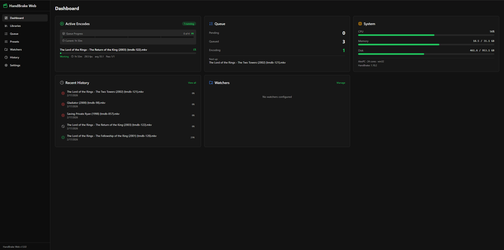
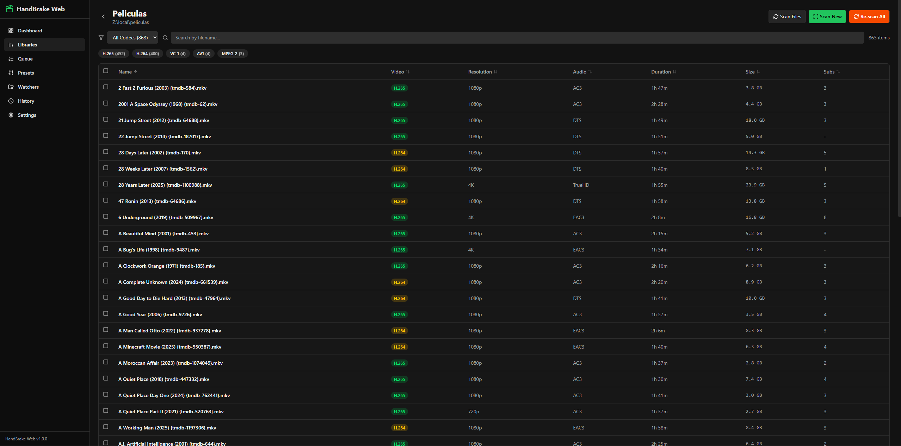
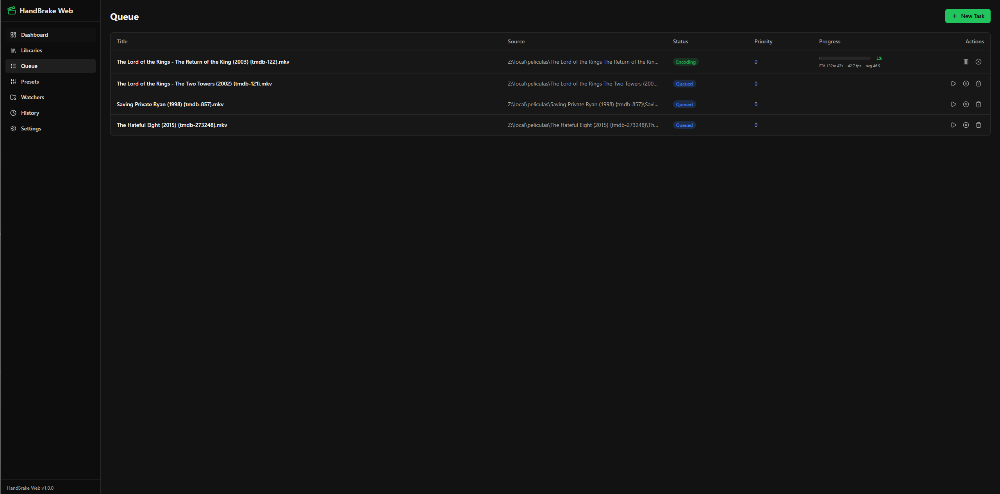
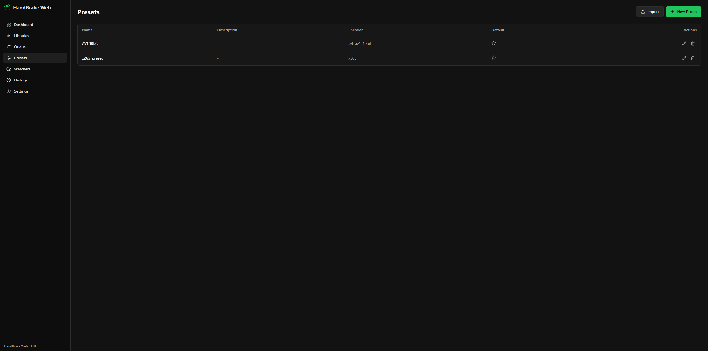
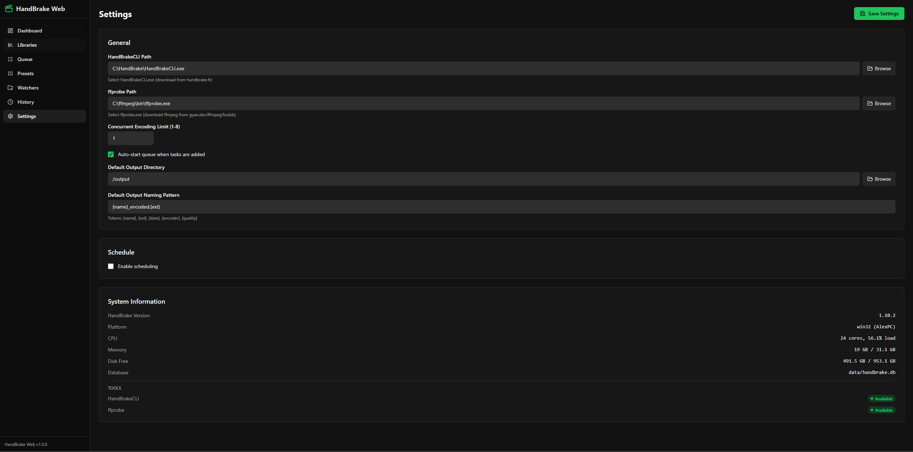

<p align="center">
  
</p>

<h1 align="center">HandBrake Web</h1>

<p align="center">
  <strong>A modern web frontend for HandBrakeCLI</strong><br/>
  Manage video encoding tasks, monitor libraries, and automate folder watching — all from your browser.
</p>

<p align="center">
  
  
  
  
  
  
</p>

---

## Overview

HandBrake Web is a self-hosted web application that wraps [HandBrakeCLI](https://handbrake.fr) with a clean, modern interface. Think of it as a simpler alternative to [Tdarr](https://tdarr.io), focused on ease of use and transparency.

### Key Features

| Feature | Description |
|---------|-------------|
| **Task Queue** | Create, prioritize, pause, resume, and cancel encoding jobs with real-time progress |
| **Live Progress** | See encoding percentage, FPS, ETA, and current pass in real-time |
| **Libraries** | Scan media folders, detect codecs (H.264, H.265, AV1), filter and search |
| **Presets** | Save and reuse encoding configurations, import HandBrake JSON presets |
| **Folder Watchers** | Automatically detect new files and queue them for encoding |
| **Scheduling** | Restrict encoding to specific hours and days of the week |
| **Delete Source** | Optionally delete the original file after successful encoding |
| **GPU Encoding** | NVIDIA NVENC support for hardware-accelerated encoding |
| **Dark Theme** | Modern dark UI built with Tailwind CSS |

---

## Screenshots

### Dashboard

The dashboard gives you a quick overview of your system: active encoding jobs with live progress, queue status, and system resources (CPU, disk space, HandBrake version).

<p align="center">
  
</p>

### Libraries

Scan your media folders and inspect every file's codec, resolution, audio tracks, subtitles, duration, and file size. Filter by codec to quickly find files that need re-encoding.

<p align="center">
  
</p>

### Task Queue

Manage all encoding jobs in one place. See status, progress, priority, and quickly start, pause, resume, or cancel any task.

<p align="center">
  
</p>

### Task Creation

A 4-step wizard guides you through creating encoding tasks: select source, configure video/audio/subtitle/filter options, set output path, and review before submitting.

<p align="center">
  
</p>

### Presets

Save frequently-used encoding configurations as presets. Import presets from HandBrake's native JSON export format.

<p align="center">
  
</p>

### Settings

Configure HandBrakeCLI and ffprobe paths, default output directory, concurrent encoding limit, and auto-start behavior. Browse buttons let you navigate the filesystem visually.

<p align="center">
  
</p>

---

## Architecture

```
+-----------------------------------------------------------------+
|                       Browser (React 19)                        |
|                                                                 |
|  Dashboard | Libraries | Queue | Presets | Watchers | Settings  |
|                                                                 |
|  SWR Polling ---------------------------------> REST API        |
+-------------------------------+---------------------------------+
                                | HTTP
+-------------------------------v---------------------------------+
|                    Next.js 16 App Router                        |
|                                                                 |
|  /api/tasks          Task CRUD + actions (start/pause/cancel)   |
|  /api/presets        Preset management + HandBrake JSON import  |
|  /api/libraries      Library scan + ffprobe media analysis      |
|  /api/watchers       Folder watcher management                  |
|  /api/system         System stats (disk, CPU, tool versions)    |
|  /api/schedule       Encoding schedule (time windows + days)    |
|  /api/settings       App configuration key-value store          |
|                                                                 |
+-----------------------------------------------------------------+
|                      Backend Services                           |
|                                                                 |
|  QueueManager ---- Spawns HandBrakeCLI processes                |
|       |            Parses multiline JSON progress via stderr    |
|       |            Brace-counting accumulator for robustness    |
|       |            Handles pause/resume (SIGSTOP/SIGCONT)       |
|       |            Deletes source file after completion (opt.)  |
|       |                                                         |
|  Scheduler ------- Evaluates time windows & day-of-week rules  |
|                                                                 |
|  MediaProbe ------ ffprobe (primary) / HandBrakeCLI --scan      |
|                    Detects codec, resolution, audio, subtitles  |
|                                                                 |
|  WatcherManager -- Periodic folder scanning at intervals        |
|                    Auto-creates tasks from new files             |
|                                                                 |
+-----------------------------------------------------------------+
|                     SQLite Database                              |
|                                                                 |
|  tasks | task_history | presets | libraries | library_items      |
|  watched_folders | scanned_files | schedule | settings          |
+-----------------------------------------------------------------+
```

---

## Getting Started

### Prerequisites

- **Node.js** 20+ (for development / bare-metal)
- **HandBrakeCLI** installed and accessible in PATH
- **ffprobe** (part of FFmpeg) for media analysis

### Development

```bash
# Clone the repository
git clone https://github.com/Alexaalex93/handbrake_web.git
cd handbrake_web

# Install dependencies
npm install

# Start the development server
npm run dev

# Open http://localhost:3000
```

### Production (Node.js)

```bash
npm run build
npm start
```

### Docker

```bash
# CPU only
docker compose up -d

# With NVIDIA GPU support
# 1. Uncomment the GPU section in docker-compose.yml
# 2. Ensure nvidia-container-toolkit is installed
docker compose up -d
```

The container includes HandBrakeCLI and ffmpeg/ffprobe pre-installed.

#### Docker Compose

```yaml
services:
  handbrake-web:
    build: .
    image: alex/handbrake-web:latest
    container_name: handbrake-web
    ports:
      - "3000:3000"
    volumes:
      - handbrake-data:/app/data          # Database persistence
      - /path/to/your/media:/media        # Mount your media folders
    restart: unless-stopped

volumes:
  handbrake-data:
```

#### NVIDIA GPU Encoding

To enable hardware-accelerated encoding with NVENC:

1. Install [NVIDIA Container Toolkit](https://docs.nvidia.com/datacenter/cloud-native/container-toolkit/install-guide.html)
2. Uncomment the GPU section in `docker-compose.yml`
3. Select `nvenc_h264` or `nvenc_h265` as the video encoder when creating tasks

---

## Configuration

### Settings Page

All settings are configurable through the web UI at `/settings`:

| Setting | Default | Description |
|---------|---------|-------------|
| HandBrakeCLI Path | `HandBrakeCLI` | Path to the HandBrakeCLI executable |
| ffprobe Path | `ffprobe` | Path to the ffprobe executable |
| Default Output Dir | `/output` | Default directory for encoded files |
| Concurrent Limit | `1` | Maximum simultaneous encoding jobs |
| Auto-Start Queue | `true` | Automatically start queued tasks |

### Default Encoding Preset

The built-in default preset is optimized for transparent quality:

| Parameter | Value | Rationale |
|-----------|-------|-----------|
| Video Encoder | x265 (H.265) | Best compression efficiency |
| Quality (RF) | 18 | Visually transparent — nearly lossless |
| Encoder Preset | slow | Better compression at same quality vs medium |
| Audio | copy (passthrough) | Preserves original audio without re-encoding |
| Container | MKV | Wide compatibility, supports all codecs |

**Expected results**: A 22 GB H.264 1080p file typically compresses to ~8-12 GB with these settings, with no visible quality loss.

#### Quality Guide

| RF Value | Quality | Use Case |
|----------|---------|----------|
| 14-16 | Near-lossless | Archival, high-motion content |
| **18** | **Transparent** | **Recommended — no visible difference** |
| 20 | Excellent | Barely noticeable, good space savings |
| 22 | Good | Noticeable on close inspection |
| 24+ | Acceptable | Significant compression, visible artifacts |

---

## Features in Detail

### Libraries

Libraries let you scan and catalog your media collection:

- **Scan Files** — Discover new and removed files on disk (no media analysis)
- **Scan New** — Discover files + analyze only new/unscanned ones (incremental, fast)
- **Re-scan All** — Re-analyze every file from scratch (slow, use when needed)

Each file shows:
- Video codec (H.264 / H.265 / AV1) with color-coded badges
- Resolution (4K / 1080p / 720p / 480p) — detected from both width AND height
- Audio codec (DTS / AC3 / AAC / TrueHD / FLAC)
- Duration, file size, subtitle count

Filter by codec, search by filename, paginate through large libraries.

### Task Queue

The queue system supports:
- **Priority ordering** — Higher priority tasks run first
- **Concurrent encoding** — Run multiple jobs simultaneously (configurable)
- **Pause / Resume** — Pause encoding and resume later (SIGSTOP/SIGCONT)
- **Cancel** — Stop encoding with cleanup
- **Retry** — Re-queue failed tasks
- **Live progress** — Real-time percentage, FPS, ETA, pass info

### Encoding Options

All HandBrakeCLI encoding options are exposed through the UI:

**Video**
- Encoders: x264, x265, NVENC H.264/H.265, SVT-AV1, VP9, and more
- Quality modes: Constant Quality (RF/CRF) or Average Bitrate
- Encoder presets: ultrafast to placebo
- Encoder tunes: film, animation, grain, stillimage, etc.
- Multi-pass encoding with optional turbo first pass

**Audio**
- Multiple audio tracks with per-track configuration
- Encoders: passthrough (copy), AAC, AC3, EAC3, Opus, FLAC, MP3
- Mixdown: mono, stereo, 5.1, 7.1
- Per-track bitrate, sample rate, gain, DRC

**Subtitles**
- Select and reorder subtitle tracks
- Burn subtitles into video
- External SRT file support with offset

**Filters**
- Deinterlace: Yadif, Decomb, BWDif
- Denoise: NLMeans, HQDN3D
- Deblock, rotation, flip, grayscale

**Picture**
- Resolution scaling
- Anamorphic modes: auto, strict, loose, custom
- Cropping: auto-detect, none, or custom values

**Container**
- Formats: MKV, MP4, WebM
- Chapter markers, web-optimized MP4, iPod compatibility

### Delete Source

When creating a task, you can enable **"Delete source file after encoding"**. This will:

1. Wait for encoding to complete successfully (exit code 0)
2. Verify the output file exists and has a valid size (> 0 bytes)
3. Delete the original source file
4. Log the deletion to the server console

This is useful for re-encoding entire libraries to save disk space.

### Folder Watchers

Watchers automatically monitor directories for new media files:

- Configurable scan interval (default: 60 seconds)
- Recursive directory scanning
- File extension filtering
- Minimum file size threshold
- Auto-create tasks using a selected preset
- Output mode: beside source or fixed directory

### Scheduling

Restrict encoding to specific time windows:

- **Always** — Encode 24/7
- **Time Window** — Only encode between specific hours (e.g., 22:00 - 08:00)
- **Day Selection** — Choose which days of the week to encode
- Active jobs are NOT interrupted when the window closes

---

## Tech Stack

| Component | Technology |
|-----------|-----------|
| Framework | [Next.js 16](https://nextjs.org/) (App Router) |
| Language | TypeScript |
| Frontend | React 19 + SWR |
| Styling | Tailwind CSS v4 |
| Icons | Lucide React |
| Database | SQLite via [better-sqlite3](https://github.com/WiseLibs/better-sqlite3) |
| Video | [HandBrakeCLI](https://handbrake.fr) |
| Media Info | [ffprobe](https://ffmpeg.org) (FFmpeg) |
| Validation | Zod |

---

## Project Structure

```
src/
├── app/
│   ├── (dashboard)/              # Route group with sidebar layout
│   │   ├── page.tsx              # Dashboard
│   │   ├── queue/                # Task queue + detail view
│   │   ├── libraries/            # Library list + detail view
│   │   │   └── [id]/page.tsx     # Library detail (scan, filter, search)
│   │   ├── presets/              # Preset management
│   │   ├── watchers/             # Folder watchers
│   │   ├── history/              # Encoding history
│   │   └── settings/             # App configuration
│   └── api/
│       ├── tasks/                # Task CRUD + actions
│       ├── presets/              # Preset CRUD + import
│       ├── libraries/            # Library scan + probe + progress
│       ├── watchers/             # Watcher management
│       ├── system/               # System stats
│       ├── scan/                 # Media file scanning
│       ├── schedule/             # Encoding schedule
│       └── settings/             # Settings API
├── components/
│   ├── layout/                   # Sidebar, header
│   ├── dashboard/                # Dashboard cards (stats, jobs, queue)
│   ├── queue/                    # Task list, creation dialog
│   ├── encoding/                 # Video, audio, subtitle, filter panels
│   └── shared/                   # File browser, SWR provider
├── lib/
│   ├── db/                       # SQLite singleton + schema + migrations
│   ├── handbrake/                # CLI wrapper, JSON parser, preset import
│   ├── queue/                    # Queue manager, scheduler
│   ├── media-probe.ts            # ffprobe / HandBrakeCLI scan wrapper
│   └── system.ts                 # System stats with TTL caching
└── types/                        # TypeScript interfaces
```

---

## API Reference

### Tasks

| Method | Endpoint | Description |
|--------|----------|-------------|
| GET | `/api/tasks` | List all tasks (optional `?status=queued`) |
| POST | `/api/tasks` | Create a new task |
| GET | `/api/tasks/:id` | Get task details |
| PUT | `/api/tasks/:id` | Update a pending/queued task |
| DELETE | `/api/tasks/:id` | Delete/cancel a task |
| POST | `/api/tasks/:id/actions` | Start, pause, resume, cancel, retry |
| GET | `/api/tasks/stats` | Queue statistics |

### Libraries

| Method | Endpoint | Description |
|--------|----------|-------------|
| GET | `/api/libraries` | List all libraries |
| POST | `/api/libraries` | Create a library |
| GET | `/api/libraries/:id` | Get library items (paginated, filterable) |
| POST | `/api/libraries/:id/scan` | Scan + probe library (background) |
| GET | `/api/libraries/:id/scan/progress` | Poll scan/probe progress |

### Presets

| Method | Endpoint | Description |
|--------|----------|-------------|
| GET | `/api/presets` | List all presets |
| POST | `/api/presets` | Create a preset |
| PUT | `/api/presets/:id` | Update / set as default |
| DELETE | `/api/presets/:id` | Delete a preset |
| POST | `/api/presets/import` | Import HandBrake JSON presets |

### System

| Method | Endpoint | Description |
|--------|----------|-------------|
| GET | `/api/system` | System info, disk usage, tool status |
| GET | `/api/settings` | Get all settings |
| PUT | `/api/settings` | Update settings |
| GET | `/api/schedule` | Get schedule config |
| PUT | `/api/schedule` | Update schedule |

---

## Environment Variables

| Variable | Default | Description |
|----------|---------|-------------|
| `PORT` | `3000` | Server port |
| `NODE_ENV` | `development` | Node environment |
| `NEXT_TELEMETRY_DISABLED` | `1` | Disable Next.js telemetry |
| `HOSTNAME` | `0.0.0.0` | Bind address (Docker) |

---

## Troubleshooting

### Encoding progress stays at 0%

HandBrakeCLI with `--json` outputs progress as multiline JSON blocks to **stderr** (not stdout). The app uses a brace-counting JSON accumulator to parse these blocks correctly. Check the server console for:

```
[handbrake] Task 1: progress parsing active (WORKING 5%)
```

If you don't see this message, verify HandBrakeCLI is installed and the path is correct in Settings.

### Resolution shows as 720p for 1080p content

Some videos have non-standard heights (e.g., 1920x1040). The app checks **both width and height** to classify resolution:
- Width >= 3840 OR height >= 2160 -> 4K
- Width >= 1920 OR height >= 1080 -> 1080p
- Width >= 1280 OR height >= 720 -> 720p

### Library scan only finds partial files

Use **"Re-scan All"** to force re-probe every file. The incremental **"Scan New"** only probes files with `pending` status (new or previously failed).

### Page flickering / refreshing

The app uses SWR with `revalidateOnFocus: false` and reduced polling intervals. If flickering persists in development mode, it may be caused by Next.js Hot Module Replacement (HMR) — this doesn't happen in production builds.

### Windows: disk stats error

The app uses PowerShell (`Get-Volume`) instead of the deprecated `wmic` command for disk stats on Windows 11+.

---

## Contributing

1. Fork the repository
2. Create a feature branch: `git checkout -b feature/my-feature`
3. Commit your changes: `git commit -m "Add my feature"`
4. Push to the branch: `git push origin feature/my-feature`
5. Open a Pull Request

---

## License

ISC

---

<p align="center">
  Built with Next.js, HandBrakeCLI, and SQLite
</p>
